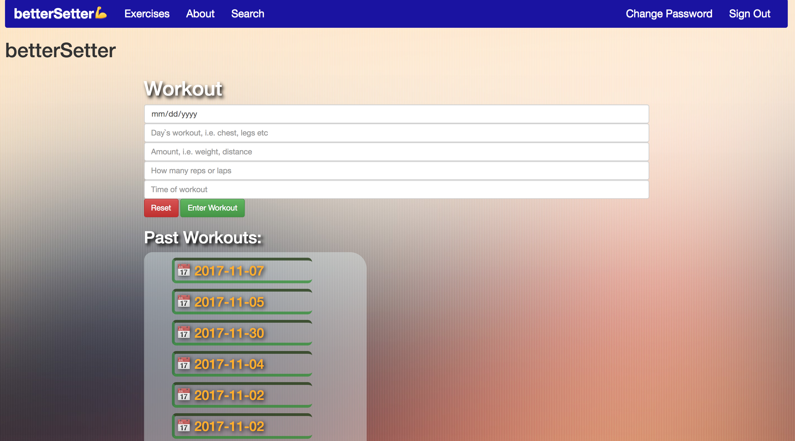

### APP DESCRIPTION:
 betterSetter is an app built to track progress during different work-out phases. Mark down when and what you did so you can easily call up your last workout to get a better set every week.

 

### LINKS:
  | betterSetter: https://cmguido.github.io/betterSetter/#/exercises |
  | Front-end repo: https://github.com/cmguido/betterSetter          |
  | Back-end repo: https://github.com/cmguido/betterSetter-backend   |
  | Deployed back-end: https://ghastly-skeleton-14353.herokuapp.com/ |

### USER STORIES
 - A user will sign-up, sign-in, change-password and sign-out so that they
  have full auth rights with their account.
 - A user will be able to create a day so that can track which days they worked
 out.
 - A user will be able to add information when they create a day so they what
 what exercise(s) they did that day.
 - A user will be able to delete a day if they messed up the information so
 they can start again if they want.
 - A user will be able to edit information from a specific day so if they
 planned to do a workout ahead of time and couldn't/did more they can adjust the
 information so it is correct.
 - A user will be able to see past workouts so they can check progress or
 maintain their current workout regiment with the correct times/weights.

 ### REACH USER STORIES
 - A user will be able to search google from within the app to find any
 exercises they don't know so they can learn what it is. (clicking would lead
 outside of app)

### Link to wireframe & ERD: https://imgur.com/a/QP0xg

### PLAN & PROBLEMS
  - I started by creating some user stories to track how my app would perform, basic auth and then CRUD actions to make sure a user could create, view, update and delete any workout they wanted.
  - Following this initial planning stage, I used it to create and set up the back-end via heroku and rails. This deployment went smoothly.
  - Next I had to set up the front-end repo, which was not too bad until I had to deploy ember, at which point it kept hitting errors. I went back and made sure every name matched, and it was pointing to my repo, and had the correct back-end URL. Ultimately it was solved by deleting the local copy and starting over again, once again going step by step through the ember deployment guide.
  - Things went smoothly once again until I had to make my edit workout feature. For some reason, when I passed the action up it couldn't find the data to use. To solve this, in my update function I used 'this.currentModel' to make sure it updated the correct and current object. It was a feature I used for create as well.
  - Once I completed these features I attempted to start my third-party-API google search. I created a route for this and added the necessary code via the google docs for custom-search. It works for the most part with it vaguely not appearing at times, but will if 'search' in the navbar is clicked on again. This is something I am going to continue to look into as I receive no error messages regarding it.

### TECH USED
  - Ember, Ruby on Rails, JavaScript, HTML, CSS, Handlebars, Git, GitHub, Heroku.

### Link to wireframe & ERD: https://imgur.com/a/QP0xg
